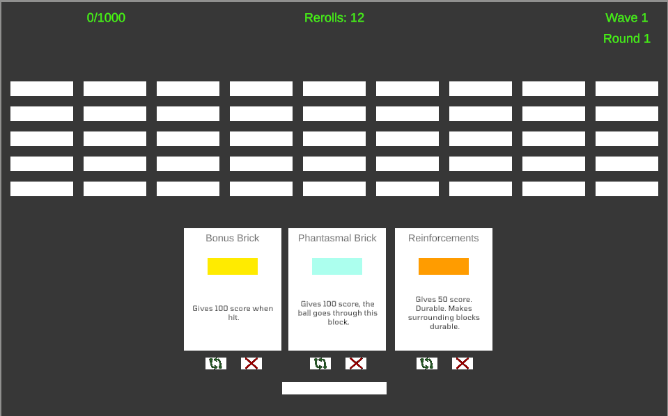

# Breakout Reflection
## Prototype 1

For the first prototype, I wanted to implement power-ups in breakout, which is what this prototype was about. I wanted to create something that could give the player some control over what happens on the board besides the paddle movement. From this prototype, I learned a few things about rigidbody behavior and how it is controlled, especially when it comes to collisions.

During the playtest, I learned that relying on Unity physics is not great since it had a lot of unexpected behaviors when the ball hit the bricks. Furthermore, I got a better understanding of what players may find valuable when it comes to using power-ups, and I also learned something about the input system in Unity in terms of how GetAxis differs from GetAxisRaw. 

[Breakout Prototype 1](https://robjg-1234.github.io/game-dev-spring2025/builds/breakout-1)

## Prototype 2-A

In this prototype, I wanted to experiment with the 2D version of Unity, which I had not used much, and also try an idea where you played as both the paddle and the walls. This meant that there were four paddles, and you played all of them simultaneously. Here, I learned about the 2D version of the components, which are very similar to the 3D version.
 
 

[Breakout Prototype 2-A](https://robjg-1234.github.io/game-dev-spring2025/builds/breakout-2a)

 

## Prototype 2-B

This prototype was an expansion of the original prototype in which I wanted to implement something that changed the gameplay in a negative way, so in addition to having power-ups, the player would need to avoid a negative version of the power-up brick, which would actively hinder the player. In this prototype, I learned how fun it is to mess with the player and also worked with some visual cues to let people know what was happening inside the game.

During playtesting, I got some feedback on difficulty scaling since the game started too slow, and then it suddenly went really fast, so learning how to properly balance it is something that I kept in mind moving forward.

[Breakout Prototype 2-B](https://robjg-1234.github.io/game-dev-spring2025/builds/breakout-2b)

## Prototype 3

The idea for this prototype was to make a Roguelike version of Breakout. After playing a game called [Ballionaire](https://store.steampowered.com/app/2667120/Ballionaire) I had a vague idea about how I wanted the gameplay loop to feel like. I wanted to emphasize the board instead of the ball and the paddle, so the way I went about it was to design bricks that had different characteristics to reach a score that increased each "wave." Throughout it I experimented with different types of effect that went from affecting the score to generating outside effects, because I wanted to emphasize thinking abut the bricks and how they interacted with each other.
From this game I learned about how difficult it is to implement a UI that interacts with in-game objects while still being understandable, additionally I learned how hard it is to explain concepts to players in small areas of text.

During the playtesting, I learned about how difficult it can be to get a lot of concepts thrown at you very fast, specially in this genre of video games where alot of the knowledge comes from trying stuff out if you don't like to read, and sometimes even reading doesn't help. Additionally, I saw that sometimes people didn't know what was happening because of the same thing.

[Breakout Prototype 3](https://robjg-1234.github.io/game-dev-spring2025/builds/breakout-3)

## Final Protoype

The last prototype was a refined version of the last prototype. I wanted to focus on improving the UI feel, so that clicks felt more "powerful" and also wanted to make it easier to gain feedback from what was happening inside the game. Additionally there were some minor bug fixes. In this one I learned about the connection between world object and the UI space specially for a 2D game, and what causes satisfaction to the player. In the case of this game I added a way to see "number go up" in a more real time situation which made every hit feel more impactful.
 
 

[Final Prototype](https://robjg-1234.github.io/game-dev-spring2025/builds/breakout-final)
