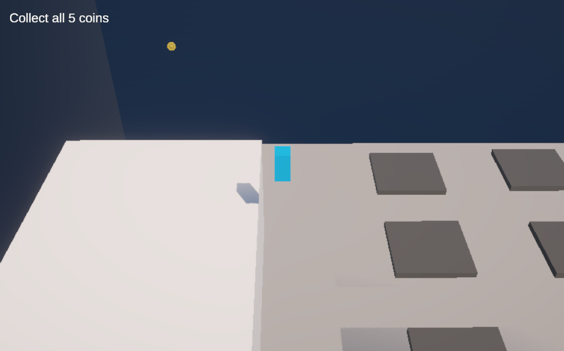
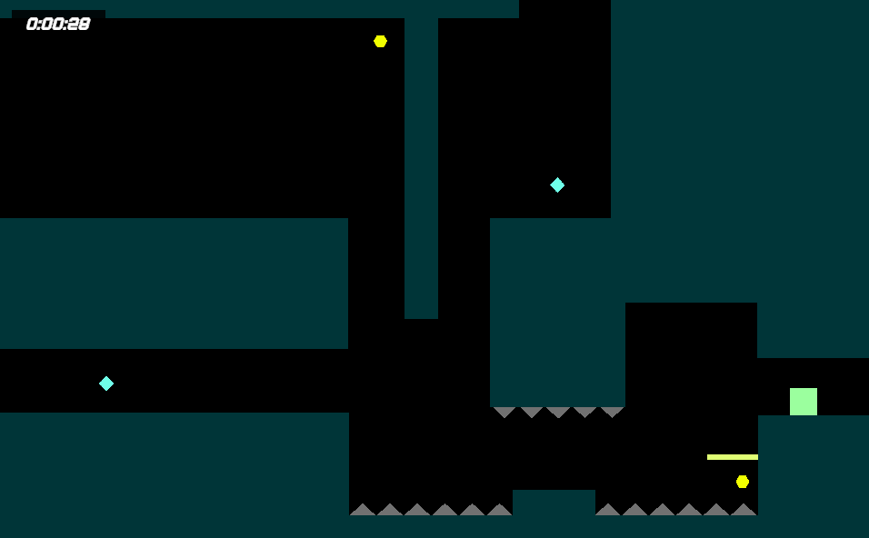
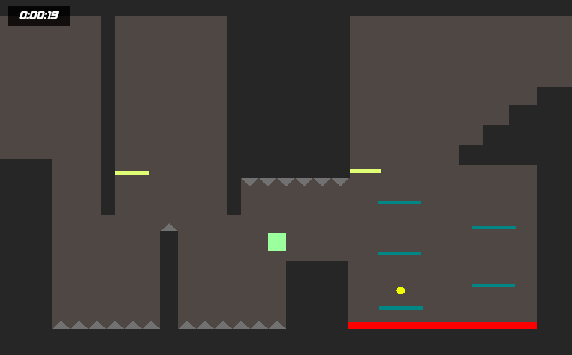
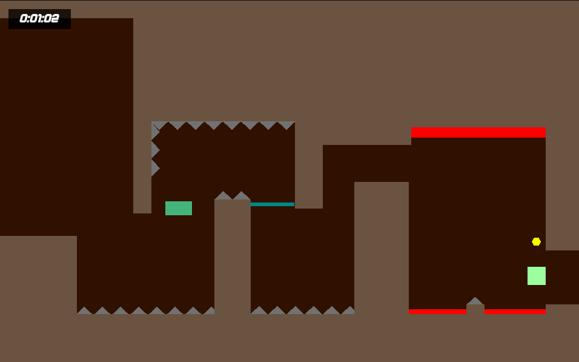

# Platformer Reflection

## Platformer 1

For the first prototype I wanted to create a 3D side scroller with a few mechanics. These involved coyote time, dashing, wall jumping, and a semi-static camera. I wanted to take Mario 3D world approach in terms of how the camera moved around which is why I used the Cinemachine camera from Unity.

I learned a little bit about Cinemachine which I had no idea how to use before, and experimented with some of the physics in order to make the game feel like dash focus which allowed me to do fun things with momentum and direction changing in the air. Additionally I learned a little bit about what makes wall jumping feel not good, and also how to create levels with the mechanics in mind.

[Play it here](https://robjg-1234.github.io/game-dev-spring2025/builds/platformer-1/)
## Platformer 2

The second prototype was entirely different since I do not really like 3D platformers and I had a more concrete idea of what I wanted to make. The entire premise of the game revolves about a pogo jumping mechanic in the form of the shield which essentially allowed the player to flip their velocity in any of the four cardinal directions. It also is uniquely on 2D which I also hadn't worked with before when it came to platformers. I expermiented with multiple mechanics and wanted to make it easy to scale so that if I had an idea I was able to just add it on top without having to do too much on the code which allowed me to add multiple mechanics that the player could interact.

From this I learned how important it is to section out your code so that it is easy to implement new stuff and iterate through different versions of the mechanics. Additionally, I learned about level design and difficulty spikes, since from different playtests it seemed like the required mechanical skills went up too fast for people to get used to the mechanic or the physics. 

[Play it here](https://robjg-1234.github.io/game-dev-spring2025/builds/platformer-2/)

## Platformer Final

The final prototype was entirely focused on seeing if what I did for the one before worked, since I wanted to see if adding new levels and mechanics was as easy as I wanted it to be, and it was, surprisingly. I wanted to add two mechanics and work on the level design. I tried to balance my levels to be more linear in terms of difficulty while maintaing some freshness to each room. Additionally I wanted to do a little bit of quality of live changes to make the player experience more enjoyable and also wanted to see how working with different levels would be like. So I added a way to select levels, pause, restart levels, and returning to the main menu. The reason for some of these quality of life changes rises entirely because I played a game that didn't have them and I wanted to see how hard it was to add them 

From this I learned a few things about making levels that introduce mechanics and also reuse previously explained mechanics without copying. Also trying to make levels that combine mechanics into a more fun and interactive experience. I also learned a little bit about saving stuff between scenes using player preferences which allowed me to save best times using a semi creative way of comparing times by storing it as hours since it only uses one easy to read variable. I also learned how easy it is to make levels when you already have the tools to make the level so you are just placing objects to shape the level as if you were making a level in Mario Maker.

[Play it here](https://robjg-1234.github.io/game-dev-spring2025/builds/platformer-final/)