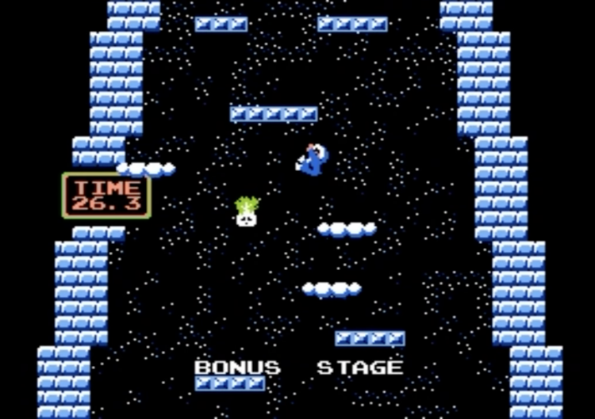
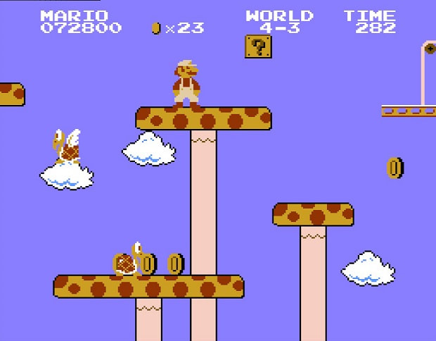
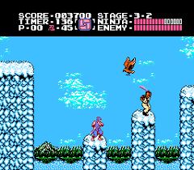

# Platformers Analysis

The games that I took a look at were: [Ice Climbers](https://en.wikipedia.org/wiki/Ice_Climber), [Super Mario Bros.](https://en.wikipedia.org/wiki/Super_Mario_Bros.), and [Ninja Gaiden](https://en.wikipedia.org/wiki/Ninja_Gaiden_(NES_video_game)). 

## Ice Climber

Ice Climber was the first game that I wanted to experience, and it was by far the one that felt the worst. While you are grounded, you can move left and right and swing a hammer; the speed is always the same, and there is no slowdown when changing directions. The only thing that can affect the character's speed is the floor type, these being what I call conveyor, which essentially pushes your character in one direction, making it move faster if you walk with it or slower if you walk against it; the other one is moving platforms which move the character along in a similar way to the conveyor, but you cannot fall from the platform.

The other element of movement, the jump, is the most important part of the game, given that the objective is to go up. All the jumps reach the same height; however, the degree to which they move sideways can be affected by the original movement. What this means is that if you are not moving, you will not move in any direction; if you start moving right before jumping, you will jump slightly to the direction you were moving, and if you were moving for like a second, you will jump in that direction and cover more horizontal distance. The type of jump has some relevance given that after you commit to a direction, you can no longer change it; however, if you are standing still before the jump, you can slightly adjust the direction of the jump after you reach its apex. The environment can also affect the jump. For example, jumping height is reduced when you hit a block since you immediately fall after hitting something; also, hitting walls while going up immediately changes your direction and moves you in that direction as if you had a running start.

The basic concept of the game is shaped around these mechanics; it is a vertical scroller, which means that you only need to be going up, which is why the jump has so much depth to it. Each mountain has different layers, which are all one jump distance away from each other. You need to break a hole in each layer to be able to successfully jump to it, which is where other elements come into play. Since you could technically keep jumping and breaking blocks, the game forces you to move by adding enemies that walk toward the center, creating natural gaps in the layers, putting unbreakable blocks on top of the place you were trying to break, or pushing you around with the conveyor belts which makes it so that you have to calculate what is the path that you need to take in order to climb. Additionally, some layers are segmented by walls, which forces you to use them as a rebound to reach the next layer. Finally, the bonus sections of each mountain combine both of these mechanics to make it more interesting since it is not only about going up but also about knowing when it is good to go down since collectibles are available which can only be reached by combining going up and down before reaching the bird.

## Super Mario Bros.

Super Mario Bros. is the second game I decided to analyze. It was the most enjoyable, but it was also not great. In this game, there is a lot of emphasis on the ground movement since there is acceleration. You can sometimes feel the game being sticky, especially if you are hitting blocks or pipes if you mistime the jumps. Reaching top speed takes around a second if you are holding sprint on the ground; if you are walking around (not holding sprint), the highest speed is reached almost immediately. While moving in one direction, you have the ability to slow down by moving in the opposite direction, which causes a severe slowdown and lets you start the acceleration in the opposite direction. Another way to slow down is letting go of sprint, which will slow you down to the max walking speed, or you can just let go of the movement button, eventually making you stop moving by slowing your character down. The type of level can affect the available move set since water levels make the character walk at a very slow speed and not be able to sprint. 

The second part of the movement is the jump. In this game, many things influence the jump. Speed is the most important factor since it bleeds into the other factors. For example, in combination with the time the jump button is pressed, it causes the amount of distance you cover in a single jump to change; if you jump on top of an enemy, the distance you bounce is determined by the speed that you have at that moment. Additionally, jumping sets your speed to the max when you land, which means that if you jump and start moving in one direction, the next movement will be done using the max speed if you keep the same direction. Furthermore, the height of the jump is based on the amount of time the button is pressed, which also affects your airborne time. The other thing that affects it is when you hit a block since it will stop your vertical movement and send you downwards very fast. While jumping, you can adjust your jump's direction, allowing you to either change the direction if the speed is not too high or simply slow down to make more precise jumps. In water levels, the jump becomes the standard movement since it is faster than going on the ground, and you can use it all the time; it sends you up at the same distance every time. If you don't press it, then you start to fall slowly; the speed of this fall is affected either by hitting the ceiling, which makes you fall faster, or by being on top of a place without ground, which sucks you in.

These mechanics heavily affect the level design since there are a lot of things in the game that force you to jump, for example, enemies, breakable blocks, obstacles, and gaps. In the initial levels, you are shown that the blocks are worth hitting by putting question mark blocks, which provide coins or power-ups, even though these elements are significantly reduced as you progress. On the other hand, enemies that punish jumping also appear to make it more engaging since it is no longer as easy to just jump on the enemies to defeat them; you have to think before doing so. A good example of this is piranha plants on pipes. Since you are not used to them, and you need to get on top of the pipe, you can get caught off guard by their sudden appearance. Finally, the ability to control your jump is tested on harder levels by making jumps with different heights and more gaps so that you cannot jump without looking where you are going.

## Ninja Gaiden

Ninja Gaiden was the final game I decided to analyze, and even though its main focus is not platforming, it plays a significant role in the way the levels are designed. In terms of ground movement, you are always moving at the same speed, which means that you can change direction without any repercussions. However, you cannot move while attacking. You have the ability to crouch to dodge attacks and to make a lower attack, and that's about it for the ground movement.

As for the jump, there is a set height, meaning that every jump is always the same unless you hit a wall, which puts you into a wall cling state. During your jump, you have a lot of control to its distance only in the direction you are looking at. You can affect it in the opposite direction, but its effect is only to stop, not a complete change. Additionally, compared to the ground movement, attacking in the air allows you to keep moving. Going back to the wall cling state since it is part of the jump mechanic, it is a very important part of the game since you cannot be pushed around in that state, and you can stay on there indefinitely, allowing you to wall jump. The wall jump itself provides horizontal movement similar to the regular jump but with very little vertical height, which means that under the correct inputs, you can climb walls since you can chain wall clings.

The Wall Cling is elementary for the level design in Ninja Gaiden; many levels have different heights that can only be reached by wall-jumping. Additionally, throughout the level, there are collectibles that can provide the player with scores or power-ups. The only way of obtaining them is by hitting them, and most of the time, they are airborne, which means that you jump and attack. Finally, the enemy spawns are also influenced by the movement mechanics; for example, the birds are a mechanic implemented to punish players for staying in a wall for too long since you can't attack directly from a wall. Additionally, you can enemies to spawn from behind, which makes the fact there is no slowdown in turning around relevant.